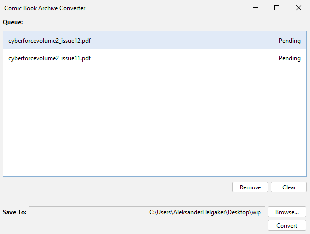

# Comic Book Archive Converter
A simple desktop application for converting files to a comic book archive (cbz). Currently supports converting PDF files to cbz files using jpeg as the image format. Future versions will allow converting between additional file and image formats.

## Development
The application is developed in Java using Swing for the interface and Maven as the build tool. To ease the creation of the interface, [JFormDesigner](https://www.formdev.com/) is used.