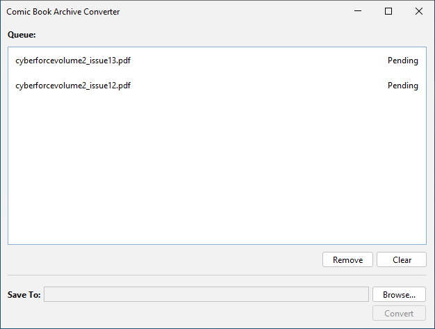

# Comic Book Archive Converter

Comic Book Archive Converter (or CBAC for short) is a simple desktop application for converting files to a comic book archive (cbz). Currently supports converting PDF files to cbz files using jpeg as the image format.

## What is cbz?
CBZ is a comic book file format. A cbz file is in reality just a zip file containing images, where each image is a page in the comic book. Pages are sorted based on file name. So for instance 000.jpg is page 1, 001.jpg is page 2, etc. CBZ is one of the most widely supported comic book file formats along with cbr (which is a rar file containing images, rather than a zip file).

CBAC currently only supports converting to the jpeg image format, but future versions will add support for other image formats, and provide more control over the image compression settings.

## How to run CBAC
Currently, you have to build the application from source. Once the application has enough features and is stable enough to be useful I will start to provide native platform executables for Windows, Mac and Linux. The plan is to automate these builds using GitHub actions and jpackage. 

## Can I convert to cbr?
CBR is based on the rar archive format which is a proprietary file format. As a result there are no plans to support converting to this format. I may add the ability to convert from cbr to cbz in a future version though.

## Development
The application is developed in Java using Swing for the interface and Maven as the build tool. To ease the creation of the interface, [JFormDesigner](https://www.formdev.com/) is used.